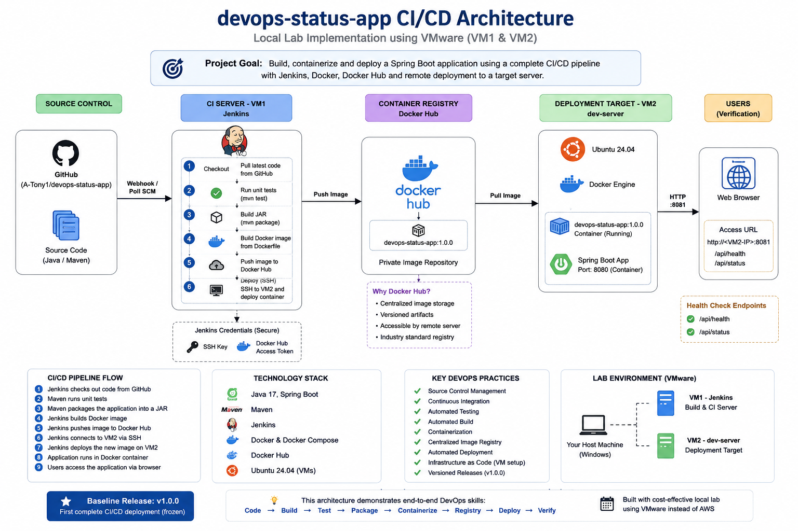

# On-Premise CI/CD Deployment Automation Project

A production-style DevOps CI/CD deployment that simulates an AWS EC2 deployment environment using two Ubuntu VMware virtual machines.

This project demonstrates how I designed and implemented an end-to-end CI/CD pipeline without requiring an AWS account, while maintaining the core workflow used in a cloud-based deployment environment.

The project builds, tests, packages, containerizes, publishes, and automatically deploys a Java Spring Boot application from GitHub through Jenkins to a remote development server.

---

## Project Objective

The objective of this project is to implement an automated CI/CD workflow that:

* Retrieves application source code from GitHub
* Runs automated Maven tests
* Packages the Spring Boot application
* Builds a Docker image
* Publishes the image to Docker Hub
* Connects to a remote application server using SSH
* Pulls the Docker image onto the application server
* Removes the previous application container
* Starts the new application container
* Exposes the application through a network port
* Verifies that the deployed application is running

The Project uses two VMware Ubuntu virtual machines to simulate a real cloud environment.

| Machine | Role                                  |
| ------- | ------------------------------------- |
| VM1     | Jenkins / CI/CD server                |
| VM2     | Remote development/application server |

VM2 is named "dev-server" and represents the remote server that would normally be an AWS EC2 [any other cloud provider] instance.

---

# Architecture

'
                         GitHub
                           |
                           | Git Push
                           v
                  +-------------------+
                  |     Jenkins VM1   |
                  |                   |
                  |  Checkout         |
                  |  Maven Test       |
                  |  Maven Package    |
                  |  Docker Build     |
                  |  Docker Push      |
                  +---------+---------+
                            |
                            | Docker Image
                            v
                     +-------------+
                     | Docker Hub  |
                     |             |
                     | azubuike1/  |
                     | devops-      |
                     | status-app  |
                     +------+------+
                            |
                            | SSH
                            v
                  +-------------------+
                  | VM2 - dev-server  |
                  |                   |
                  | docker pull       |
                  | stop old          |
                  | remove old        |
                  | docker run        |
                  +---------+---------+
                            |
                            v
                  +-------------------+
                  | Docker Container  |
                  |                   |
                  | devops-status-app |
                  |                   |
                  | 8081 -> 8080      |
                  +---------+---------+
                            |
                            v
                       Web Browser

# CI/CD Workflow

The implemented pipeline follows this workflow:

Developer
    |
    | git push
    v
GitHub
    |
    v
Jenkins VM1
    |
    +--> Checkout
    |
    +--> Maven Test
    |
    +--> Maven Package
    |
    +--> Docker Build
    |
    +--> Docker Push
    |
    v
Docker Hub
    |
    | SSH deployment
    v
VM2 / dev-server
    |
    +--> Docker Pull
    |
    +--> Stop previous container
    |
    +--> Remove previous container
    |
    +--> Start new container
    |
    v
Spring Boot Application
    |
    v
Health / Status Endpoint
`

# Technologies Used

| Technology         | Purpose                              |
| ------------------ | ------------------------------------ |
| Git                | Version control                      |
| GitHub             | Source code repository               |
| Jenkins            | CI/CD automation                     |
| Maven              | Java build and dependency management |
| Java 17            | Application runtime                  |
| Spring Boot        | Application framework                |
| Docker             | Application containerization         |
| Docker Compose     | Local container orchestration        |
| Docker Hub         | Container image registry             |
| SSH                | Remote server deployment             |
| Ubuntu             | Server operating system              |
| VMware Workstation | AWS EC2 laboratory simulation        |

---

# Application

The project contains a Spring Boot application named:

devops-status-app

The application provides endpoints for health and deployment status verification.

## Architecture

The project uses two Ubuntu VMware virtual machines to simulate a cloud-based CI/CD environment.

### Deployment Flow

GitHub
   |
   v
Jenkins — VM1
   |
   +-- Checkout
   +-- Maven Test
   +-- Maven Package
   +-- Docker Build
   +-- Docker Push
   |
   v
Docker Hub
   |
   | SSH Deployment
   v
dev-server — VM2
   |
   +-- Docker Container
   |
   v
Spring Boot Application
   |
   v
Health / Status Verification

## Health Check

GET /api/health

Example response:

json
{
  "status": "UP"
}

## Deployment Status

GET /api/status

Example response:

json
{
  "environment": "dev-server",
  "deployment": "docker",
  "application": "devops-status-app",
  "status": "UP"
}

The status endpoint demonstrates the use of environment-specific configuration rather than hardcoding deployment information into the application.

# Local Infrastructure

## VM1 — Jenkins / CI Server

VM1 is responsible for the CI/CD process.

Responsibilities include:

* Jenkins
* Git checkout
* Maven testing
* Maven packaging
* Docker image creation
* Docker Hub publishing
* SSH-based remote deployment

Jenkins is exposed on:

http://localhost:8080

## VM2 — Development/Application Server

VM2 is named:

dev-server

It simulates a remote AWS EC2 application server.

The application is deployed to VM2 through SSH from Jenkins.

The Docker container exposes:

8081:8080

Therefore, the application can be accessed through:
http://localhost:8081/api/status
when accessed from VM2.

The VM2 address used in this project is:

192.168.146.138

# Docker

The Spring Boot application is packaged into a Docker image using Java 17.

The Dockerfile:

* Uses Amazon Corretto 17
* Creates the application working directory
* Copies the packaged Spring Boot JAR
* Starts the application using `java -jar`

The Docker image used by the CI/CD pipeline is:

azubuike1/devops-status-app:1.0.0

# Docker Compose

Docker Compose is used as part of the local development and container-management workflow.

The Compose configuration allows the Docker image to be supplied through an environment variable:

yaml
image: ${IMAGE}
For example:

bash
export IMAGE=devops-status-app:1.0.0
docker compose up -d
The deployment can be verified with:

bash
docker compose ps

And the application can be tested with:

bash
curl http://localhost:8081/api/health
curl http://localhost:8081/api/status

Docker Compose provides a convenient local deployment mechanism, while the Jenkins pipeline uses direct Docker commands for the automated remote deployment to VM2.

# Jenkins CI/CD Pipeline

The Jenkins pipeline contains the following stages:

Checkout
   |
   v
Test
   |
   v
Package
   |
   v
Docker Build
   |
   v
Docker Push
   |
   v
Deploy to dev-server

## 1. Checkout

Jenkins retrieves the application source code from GitHub.

## 2. Test

Maven executes the automated tests:

bash
mvn test

## 3. Package

The application is packaged as a Spring Boot JAR:

bash
mvn package -DskipTests

## 4. Docker Build

Jenkins builds the Docker image:

bash
docker build -t azubuike1/devops-status-app:1.0.0 .

## 5. Docker Push

Jenkins authenticates securely with Docker Hub using Jenkins credentials and pushes:

azubuike1/devops-status-app:1.0.0

## 6. Deploy to VM2

Jenkins connects to VM2 through SSH and executes the deployment commands remotely.

The deployment process:

Docker Pull
     |
     v
Stop Existing Container
     |
     v
Remove Existing Container
     |
     v
Run New Container

The application is then available on port :8081 .

# Remote Deployment

The remote deployment server is accessed using SSH.

The Jenkins server connects to:

dev-server@192.168.146.138

SSH key authentication is used rather than manually entering a password during every deployment.

This demonstrates a common DevOps practice of using automated, non-interactive authentication for server-to-server deployment.

# Deployment Verification

After deployment, the application can be verified on VM2 with:

bash
docker ps

Example:

``
devops-status-app
0.0.0.0:8081->8080/tcp

The application can then be tested with:

bash
curl http://localhost:8081/api/status

Example successful response:

json
{
  "environment": "dev-server",
  "status": "UP",
  "application": "devops-status-app",
  "deployment": "docker"
}

The application was also successfully verified through a web browser.

# AWS EC2 Simulation

This laboratory intentionally replaces AWS EC2 infrastructure with VMware Ubuntu virtual machines.

| AWS Environment        | Local Laboratory             |
| ---------------------- | ---------------------------- |
| EC2 CI/Build Server    | VM1                          |
| EC2 Development Server | VM2                          |
| AWS Security Groups    | VMware/network configuration |
| EC2 Private IP         | VM IP address                |
| SSH to EC2             | SSH to "dev-server"          |
| Container Registry     | Docker Hub                   |

The purpose is to provide a realistic hands-on DevOps environment without requiring continuous AWS infrastructure costs.

The architecture can later be migrated to AWS EC2 with minimal changes to the overall CI/CD concepts.

---

# DevOps Practices Demonstrated

This project demonstrates practical experience with:

* Git-based development
* GitHub repository management
* CI/CD pipeline design
* Jenkins Declarative Pipeline
* Automated Maven testing
* Maven application packaging
* Docker image creation
* Docker image tagging
* Docker Hub publishing
* Docker container deployment
* Docker Compose
* Environment-based configuration
* SSH key authentication
* Remote server deployment
* Separation of CI and deployment environments
* Application health verification
* Deployment verification
* Infrastructure simulation using VMware
* Version-controlled CI/CD configuration

---

# Git Versioning

The first complete CI/CD deployment has been frozen as:

v1.0.0

Release description:

First complete CI/CD deployment
This provides a known-good baseline for future development and experimentation.

# Project Structure
Local-aws-ec2-CI-CD-Lab/
│
├── .gitignore
├── Dockerfile
├── Jenkinsfile
├── docker-compose.yml
├── pom.xml
├── README.md
│
└── src/
    ├── main/
    │   ├── java/
    │   │   └── com/cloudinnovate/devops/
    │   │       ├── DevOpsStatusApplication.java
    │   │       └── StatusController.java
    │   │
    │   └── resources/
    │       └── application.properties
    │
    └── test/
        └── java/
            └── com/cloudinnovate/devops/
                └── StatusControllerTest.java

# Project Status

## Completed

* Spring Boot application
* Maven build
* Automated Maven testing
* Dockerfile
* Docker image creation
* Docker Compose configuration
* Environment-based configuration
* Git repository
* GitHub integration
* Jenkins CI pipeline
* Jenkins Maven configuration
* Docker Hub authentication
* Docker Hub image publishing
* SSH key-based remote access
* VM1 CI/CD server
* VM2 development/application server
* Automated Docker deployment to VM2
* Application deployment verification
* Browser-based application verification
* CI/CD baseline tagged as `v1.0.0`

## Next Improvements

The next development phase will focus on:

* Automated post-deployment health checks in Jenkins
* Improved Docker image versioning
* Deployment rollback
* Pipeline notifications
* Better application observability
* Monitoring
* Security improvements
* Infrastructure as Code
* Cloud migration
* Kubernetes deployment

---

# Lessons Learned

This project demonstrates the progression from individual DevOps tools to an integrated delivery workflow.

The most important lesson is that CI/CD is not simply about running Jenkins.

The pipeline connects multiple stages:

Source Control
  
Continuous Integration
      ↓
Build
      ↓
Containerization
      ↓
Artifact Publishing
      ↓
Remote Deployment
      ↓
Application Verification

The project also demonstrates how a local VMware environment can be used to reproduce many of the practical workflows normally performed with AWS EC2 or on other cloud providers infrastructure.

# Author

**Anthony Abia**

DevOps Engineer

GitHub: https://github.com/A-Tony1
E-mail: anthonyabia.devops@gmail.com

This project is continuously evolving as part of my hands-on DevOps engineering portfolio.
